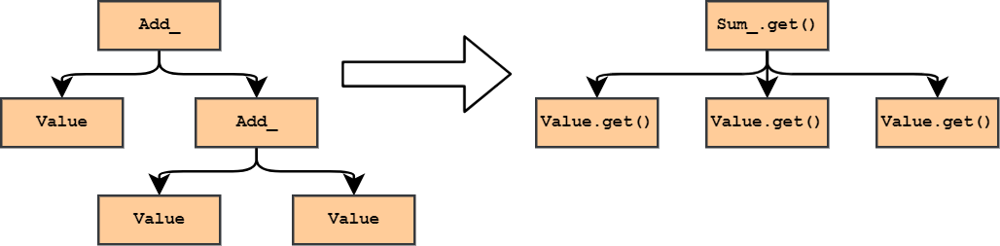
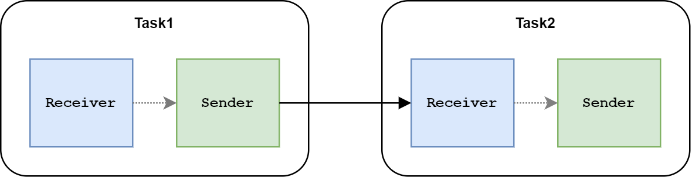

# 五 "Is that you, Responsibility Chain? No, you're someone else."

在第三节中，我们简单概括了上位者先祖 *Expression Templates* 可能具有的异能包括：
* 为任务可以选择一个特定的执行时间；
* 将任务部署到某个线程或者某个核心上；
* 增加、去除、重排、修改某些执行步骤；
* 将任务部署到不同设备，比如GPU上。

在第三节、第四节中我们拙劣愚蠢的造物*表达式求值*，拥有其中部分异能。比如可以免去不必要的执行步骤、异步执行等。
其它异能，比如如何重排执行步骤、或者部署执行任务都还没有做。这是因为我们的 *执行* 函数 `get()`（或`eval()`）直接放置在*表达*的类型（即 `Add_` 和 `Mul_`）之中。于是*执行*部分的结构，和*表达*的结构高度相似，比如下图。

这种相似性带来的优势，就是容易理解，实现简洁；劣势是不够灵活。我们用一个例子来解释对“灵活”的需求。

一般来说，四则运算的表达式都是一个二叉树。比如三个元素的加法 `a + b + c` 一般会表示成 `(a + b) + c`。如果沿用第四节的实现，那么我们的执行步骤也一定是先执行子树 `a + b`，再执行` + c`。如果这个连续加法表达式很长，那么将整棵加法树一层层递归求解显然会遇到效率问题（这里不考虑过于聪明的编译器）。此时我们可以增加一类新的节点 `Sum_`，它直接用 *for-loop* 对子树求和。 `get()`不直接返回结果，而是将`Add_`树转换成一个`Sum_`节点，最后调用`Sum_`的`get()`函数完成求值。如果用图来表示，大概类似于下面这样：

这一血疗过程的具体细节，这里不做进一步的展开，有兴趣的异乡人可以自己来一口。

在引入了变换之后，*Expression Templates*中 原本 *表达* —— *执行* 的两段式求值，演变成了 *表达* —— *演化* —— *执行* 的三段式结构。新增的*演化*一步给了我们无限想象的可能。

我们也终于开始慢慢接近上位者 `std::execution` 让人癫狂的真相。

在现在的教义中，上位者 `std::execution` 也被解释为 `Senders / Receivers Idiom` 。如果是不求甚解的教徒，可能会把这一对词汇理解成类似于下面这样：

这就有点像设计模式 responsibility chain。每个task都从上游接受一个信号，然后处理一下发送到下游。然后接收信号的角色称之为*Recevier*，发送信号的角色称之为*Sender*，然后*Sender*的信号必须发送给*Receiver*。

这种真诚而淳朴、由字面意思对设计而进行的美好设想，对于多数语境下的系统来说并不会出什么大问题，这些系统可能就是如此的单纯善良。

只可惜这是C++，一片充满了丑陋、诡怪、恐惧和失常的异世界。

> "是你吗，职责链？哦不，你不是它。 … 我需要脑浆。黯淡的，黏稠的，脑浆。———— 爱德琳"