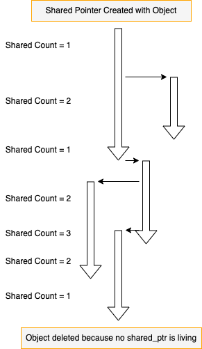

<!-- theme: gaia -->
# Pointers, smart pointers and ownership, I

<style scoped>
h1 {
    text-align: center;
    position: relative;
    top: 30%;
    font-size: 1.8em;
}
</style>

---

* 基础用例
* 坑和解决方案
* 范例和辨析
* 总结

---

Smart pointers in C++
``` C++
// C++ 98 - C++ 11
std::auto_ptr    

// C++11 to now
std::unique_ptr  // Ownership is unique and movable (move-only)
std::shared_ptr  // Ownership is shared and managed by reference counting

std::weak_ptr    // Collaborate with shared_ptr to resolve circular reference issue
```

---

为什么要有智能指针？

* 为了解决指针 _静态可访问性_ 和 _指涉对象动态生存期_ 不一致的问题
  * “Whereof one cannot speak, thereof one must be silent.”
  * 能看到的指针，就确保它所指向的对象是存活的；
  * 如果对象已经没有能看到它的指针，则可以被自动释放；
* 否则会存在以下常见问题
  * 访问已经被释放的对象
  * 访问未初始化的对象
  * 多次释放
  * 忘记释放导致资源泄漏

---

The following code will be used in our examples
``` C++
class Dog
{
public:
  Dog(std::string species, std::string name, int age) {
    // ...
  }
  std::string Species() const {
    return m_species;
  }
  void Bark() { /* ... */ }
private:
  // ...
};
```
---

Use cases of smart pointers

``` C++
std::unique_ptr<Dog> upDog1 
  = std::make_unique<Dog>("Boxer", "Meow", 2); // make_unique
auto upDog2 = std::move(upDog1);               // operator =
spDog1 = nullptr;                              // operator = (nullptr_t)
if (upDog1) {                                  // operator bool()
  std::cout << upDog1->Species() << std::endl; // operator ->
}
```

``` C++
std::shared_ptr<Dog> spDog1
  = std::make_shared<Dog>("Boxer", "Meow", 2); // make_shared
auto spDog2 = spDog1;                          // operator =
spDog1 = nullptr;                              // operator = (nullptr_t)
if (spDog2) {                                  // operator bool()
  std::cout << spDog2->Species() << std::endl; // operator ->
}
```
---

Use cases of smart pointers: `release`, `get`, `reset`
``` C++
Dog* pDog = upDog1.release();    // Returns a pointer to the managed object 
                                 //   and releases the ownership 
Dog* pDog = upDog1.get();        // Returns a pointer to the managed object
upDog1.reset(newDog);            // Replaces the managed object
upDog1.get_deleter();            // Get the deleter
```

``` C++
Dog* pDog = spDog1.get();        // Returns a pointer to the managed object
spDog1.reset(newDog);            // Replaces the managed object
spDog1.get_deleter();            // Deleter of object
spDog1.use_count();              // How many shared_ptr own this the object
spDog1.unique();                 // Removed from C++20; equiv. use_count() == 1
```

---

`unique_ptr`
  
``` C++
// Copy will be prevented
std::unique_ptr<Dog> spDog1(new Dog("Boxer", "Meow", 2));
std::unique_ptr<Dog> spDog2;
```
``` C++
// Compilation error. Copy between unique_ptrs is not allowed.
spDog2 = spDog1;
```
``` C++
// Move (transferring the ownership) is allowed
spDog2 = std::move(spDog1);
// Then: pDog is null (moved), and pDog2 holds the pointer that was in pDog.
```

* **Exclusive**-ownership
* Movable and move-only

---

`unique_ptr`

``` C++
{
  // ...
  std::unique_ptr<Dog> spDog(new Dog("Boxer", "Meow", 2));
  // ...
} // spDog->~spDog() will be called when exiting scope.
```

* RAII (**R**esource **A**cquisition **I**s **I**nitialization)
  * "A scoped life"

---

Rationale of `unique_ptr` (Pseudo code)
``` C++
template <typename T> class unique_ptr {
  T* m_ptr;
public:
  explicit unique_ptr(T* p);
  explicit unique_ptr(unique_ptr<T>&& rhs);
  this_type& operator = (unique_ptr<T>&& rhs);
  unique_ptr(this_type const& rhs) = delete;
  this_type& operator = (this_type const& rhs) = delete;
  ~unique_ptr() {delete m_ptr;}
};
```
* Has move constructor and move assignment
* Prevent copy assignment and copy constructor
* Delete object when life of ptr will be ended
---

Quiz 1: When will the `dog` be deleted?

``` C++
{
  // ...
  std::unique_ptr<Dog> spDog;
  {
    // ...
    std::unique_ptr<Dog> spDog2(new Dog("Boxer", "Meow", 2));
    // ...
    spDog = std::move(spDog2);
    // ...
  }
  // ...
}
```
* At last `}`
---

Quiz 2: Is following code correct?

``` C++
{
  // ...
  Dog* pDog = new Dog("Boxer", "Meow", 2);
  // ...
  std::unique_ptr<Dog> spDog1(pDog);
  // ...
  std::unique_ptr<Dog> spDog2(pDog);
  // ...
}
```
* Incorrect. Attempting to delete "Meow" twice.
---

Quiz 3: Is following code correct?

``` C++
{
  // ...
  Dog* pDog = new Dog("Boxer", "Meow", 2);
  // ...
  std::unique_ptr<Dog> spDog(pDog);
  // ...
  spDog.reset(new Dog("Boxer", "Wow", 2));
  // ...
}
```
* Correct. At 2nd reset, spDog will delete "Meow" then hold "Wow"
* At last `}`, "Wow" will be deleted
  
---

<style scoped>
    table {
        position: relative;
        height: 100%;
    }
    table th {
        display: none;
    }
    table tbody td {
        background-color: transparent !important;
        border-style: hidden;
        font-size: 0.8em;
    }
</style>
|||
|--|--|
| `shared_ptr`: <br>The ownership will be "shared" by reference counting<br> > **Top-down arrow** means lifetime of objects <br> > **Horizontal arrow** means _copy_ action  |  |

---

Quiz 4: When will "Meow" be deleted?

``` C++
{
  // ...
  std::shared_ptr<Dog> spDog1;
  {
    // ...
    std::shared_ptr<Dog> spDog2(new Dog("Boxer", "Meow", 2));
    // ...
    spDog1 = spDog2;
    // ...
  }
  // ...
}
```

* 2nd `}`

---
Quiz 5: Is following code correct?

``` C++
{
  // ...
  Dog* pDog = new Dog("Boxer", "Meow", 2);
  // ...
  std::shared_ptr<Dog> spDog1(pDog);
  // ...
  std::shared_ptr<Dog> spDog2(pDog);
  // ...
}
```
* Incorrect. Attempting to delete `pDog` twice.

---

Quiz 6: Is following code correct?

``` C++
{
  // ...
  Dog* pDog = new Dog("Boxer", "Meow", 2);
  // ...
  std::shared_ptr<Dog> spDog(pDog);
  // ...
  spDog.reset(new Dog("Boxer", "Wow", 2));
  // ...
}
```
* Correct
