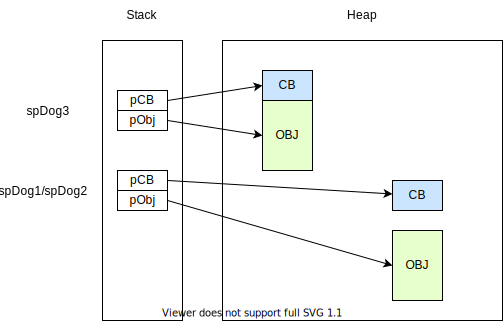
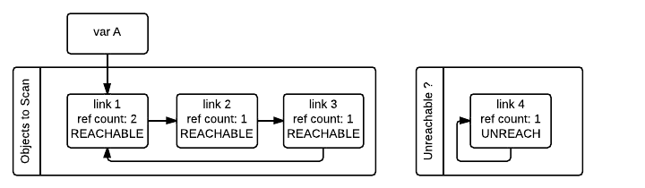

<!-- theme: gaia -->
# Pointers, smart pointers and ownership, II

<style scoped>
h1 {
    text-align: center;
    position: relative;
    top: 30%;
    font-size: 1.8em;
}
</style>

---
<style scoped>
h1 {
    position: relative;
    top: 30%;
    left: 5%;
    color: #886633;
    font-size: 1.375em;
}
ul {
  position: relative;
  top: 30%;
  left: 20%;
  font-size: 0.75em;
}
</style>

# Take a breath, and let's dive into deeper ...

* ~~回囘囬徊𢌞廻廽迴逥佪字有几种写法~~
* 智能指针有几种创建方法
* 智能指针和一般意义上的垃圾回收机制有什么不同
* `shared_ptr` 是线程安全的吗？
* 和 _裸指针_ 比，智能指针的性能如何？
* 如何 _恰当地_ 使用智能指针
* ...

---

3 ways to create a `unique_ptr`

``` C++
// 1. Create by constructor
std::unique_ptr<Dog> upDog1{ new Dog("Boxer", "Meow", 3) };
// OR       ...            (            ...              );

// 2. Create by 'reset'
std::unique_ptr<Dog> upDog3;
upDog3.reset(new Dog("Boxer", "Meow", 3));
// Illegal: upDog3 = new Dog("Boxer", "Meow", 3);

// 3. Create by make_unique
std::unique_ptr<Dog> upDog4 = std::make_unique<Dog>("Boxer", "Meow", 3); 
// OR shorter
auto upDog5 = std::make_unique<Dog>("Boxer", "Meow", 3);
```

---

3 ways to create a `shared_ptr`
``` C++
// 1. Create by constructor
std::shared_ptr<Dog> spDog1{ new Dog("Boxer", "Meow", 3) };
// OR       ...            (            ...              );

// 2. Create by `reset`
std::shared_ptr<Dog> spDog2;
spDog3.reset(new Dog("Boxer", "Meow", 3));
// Illegal: spDog3 = new Dog("Boxer", "Meow", 3);

// 3. Create by make_shared
std::shared_ptr<Dog> spDog3 = std::make_shared<Dog>("Boxer", "Meow", 3); 
// OR shorter
auto spDog4 = std::make_shared<Dog>("Boxer", "Meow", 3);
```

---

Any difference between `make_shared` and `shared_ptr<T>(new T())`?

* Don't hurt OCD!
  * No `delete`, no `new`
* `make_shared` is more efficient
  * The memory layout generated by `make_shared` is more compact
  * Cache friendly, and one less allocation than the other

---
<style scoped>
  section ul{
    list-style-type: none;
  }
  section ul img{
    width: 60%;
  }
</style>

Any difference between `make_shared` and `shared_ptr<T>(new T())`?

* `make_shared` is more efficient
  * CB: Control block, contains shared/weak counters and `deleter`

* 

---

Quiz 7: Which line(s) is(are) correct?

``` C++
auto u{std::make_unique<int>(42)};
auto s{std::make_shared<int>(42)};

u = s;              // 1
s = u;              // 2
u = std::move(s);   // 3
s = std::move(u);   // 4
```

* 4

---

Quiz 8: Which line(s) is(are) correct?

``` C++
std::shared_ptr<int> p = new int[42];
std::shared_ptr<int[]> p = new int[42];

std::unique_ptr<int> p = new int[42];
std::unique_ptr<int[]> p = new int[42];
```

---

Quiz 8: Which line(s) is(are) correct?

``` C++
std::shared_ptr<int> p = new int[42];   // Incorrect
std::shared_ptr<int[]> p = new int[42]; // Correct from C++17

std::unique_ptr<int> p = new int[42];   // Incorrect
std::unique_ptr<int[]> p = new int[42]; // Correct from C++11
```


``` C++
// Workaround in C++11 by customized deleter.
std::shared_ptr<int> sp(new int[42], [](int* p) {delete[] p;});
```

---

Now you need an array. Pick one of them.

* `T[N]`
* or `array<T, N>`, `vector<T>`
* or `shared_ptr<T[]>`, `unique_ptr<T[]>`
* or `shared_ptr<array<T, N>>`, `unique_ptr<array<T, N>>`, `shared_ptr<vector<T>>`, `unique_ptr<vector<T>>`
* or `array<shared_ptr<T>, N>`, `array<unique_ptr<T>, N>`, `vector<shared_ptr<T>>`, `vector<unique_ptr<T>>`
<br>
* 

<style scoped>
    /* section p {
        font-size: 24pt;
    } */
    section ul {
        list-style-type: none;
        font-size: 17pt;
    }
    section ul:last-child {
        text-align: right;
        font-size: 20pt;
        color: darkblue;
    }
</style>

* Will be discussed in next session

---

Type casting between `shared_ptr<T>` and `shared_ptr<U>`

``` C++
class Base { /* ... */ };
class Derived: public Base { /* ... */ };

// Correct
std::shared_ptr<Base> pBase = make_shared<Derived>();

// Compilation Failed
std::shared_ptr<Derived> pDerived = pBase;

// Runtime error
std::shared_ptr<Derived> pDerived(static_cast<Derived*>(pBase.get()));

// Correct
std::shared_ptr<Derived> pDerived = std::static_pointer_cast<Derived>(pBase);
std::shared_ptr<Derived> pDerived = std::shared_ptr<Derived>(
  pBase, dynamic_cast<Derived*>(pBase.get())); // Aliasing constructor, C++11
```

---

Convert smart pointers by following functions.

``` C++
// from C++11
template <typename T, typename U>
std::shared_ptr<T> static_pointer_cast( const std::shared_ptr<U>& r ) noexcept;

template <typename T, typename U>
std::shared_ptr<T> dynamic_pointer_cast( const std::shared_ptr<U>& r ) noexcept;

template <typename T, typename U>
std::shared_ptr<T> const_pointer_cast( const std::shared_ptr<U>& r ) noexcept;

// from C++17
template <typename T, typename U>
std::shared_ptr<T> reinterpret_pointer_cast( const std::shared_ptr<U>& r ) noexcept;
```

They may be implemented by _aliasing constructor_

---

How about cast between `unique_ptr`?

``` C++
class Base { /* ... */ };
class Derived: public Base { /* ... */ };

// For convertible types
std::unique_ptr<Base> pBase = make_unique<Derived>();

// For non-convertible types
// Forget it.
```

---

<style scoped>
  p {
      text-align: center;
      position: relative;
      top: 35%;
  }
</style>
Question: Is `shared_ptr<T>` equivalent to GC object?

---

We are designing the class for tree nodes by Python

``` Python
class Node:
    def __init__(self, parent):
        self._parent = parent
        if self._parent:
            self._parent.addChild(self)
        self._children = set()

    def addChild(self, n):
        self._children.add(n)

    def removeChild(self, n):
        self._children.remove(n)
```

* Everything looks good
---

Port it to C++

``` C++
class Node {
private:
    std::shared_ptr<Node> m_parent;
    std::vector<std::shared_ptr<Node>> m_children;
    // ...
public:
    void addChild(std::shared_ptr<Node> const& n) { /* ... */ }
    void removeChild(std::shared_ptr<Node> const& n) { /* ... */ }

    static std::shared_ptr<Node> CreateNode(std::shared_ptr<Node> const& parent) { /* ... */ }
    // ...
};
```

* Why do we need `CreateNode`?
  * Getting `shared_ptr` of itself is not a trivial problem 

---

Then do some boring thing

``` Python
def doBoringStuff():
    for i in range(100):
      root = Node(None)
      c = Node(root)
    gc.collect() # We assume that gc.collect do its duty.
```

``` C++
void doBoringStuff() {
  for (int i = 0; i < 100; ++i) {
    auto root = CreateNode( std::shared_ptr<Node>() );
    auto c = CreateNode( root );
  }
}
```

* How many `Node` objects are living while `doBoringStuff` returned?

---

* Python Version: `0` :smiley:

<br>
<br>
<br>

* C++ Version: `200` :hankey:

---
* Why?
  * Circular referencing



* Solution - change the declaration of `m_parent` to:
  * `Node* m_parent;` OR
  * `std::weak_ptr<Node> m_parent;`

---

`weak_ptr`: Construction, `expired`, `use_count` and `lock`

``` C++
{
  weak_ptr<Dog> wpDog;
  {
    shared_ptr<Dog> spDog = make_shared<Dog>("Boxer", "Meow", 3);
    wpDog = spDog;
    std::cout << wpDog.expired();
    std::cout << wpDog.use_count();
    shared_ptr<Dog> spDog2 = wpDog.lock();
    std::cout << spDog2.get();
    std::cout << wpDog.use_count();
  }
  std::cout << wpDog.use_count();
  shared_ptr<Dog> spDog3 = wpDog.lock();
  std::cout << wpDog.expired();
  std::cout << spDog3.get();
}
```

---

`weak_ptr`

``` C++
{
  weak_ptr<Dog> wpDog;
  {
    shared_ptr<Dog> spDog = make_shared<Dog>("Boxer", "Meow", 3);
    wpDog = spDog;
    std::cout << wpDog.expired();     // False
    std::cout << wpDog.use_count();   // 1; use_count() returns shared count
    auto spDog2 = wpDog.lock();       
    std::cout << spDog2.get();        // spDog2.get() == spDog.get();
    std::cout << wpDog.use_count();   // 2;
  }
  std::cout << wpDog.use_count();     // 0; spDog and spDog2 were released.
  auto spDog3 = wpDog.lock();         // spDog3 is null.
  std::cout << wpDog.expired();       // True
  std::cout << spDog3.get();          // null.
}
```

---

Quiz: Is following code correct?

``` C++
class Plugin {
  std::weak_ptr<Document> m_doc;
  void ProcessDoc() {
    auto pDoc = m_doc.lock().get();
    CreateDocHotWordView(pDoc);
  }
};
```

* No. The locked shared pointer is released after statement `auto pDoc = ...`. If the owner releases the object after `pDoc` was assigned, then `pDoc` becomes a dangling pointer.
* It is fault of C++ standard. `get()` should be `ref`-qualified.

---

The correct one:
``` C++
class Plugin {
  std::weak_ptr<Document> m_doc;
  void ProcessDoc() {
    auto spDoc = m_doc.lock();
    CreateDocHotWordView(spDoc.get());
  }
};
```
Or (but not suggested):
``` C++
class Plugin {
  std::weak_ptr<Document> m_doc;
  void ProcessDoc() { CreateDocHotWordView(m_doc.lock().get()); }
};
```

---
<!-- <style scoped>
  pre {
      font-size: 0.75em;
  }
</style> -->
Quiz: Is following code thread safety?

``` C++
class Page {
  // ...
  void beginEdit();    // lock and unlock for exclusive operations such as editing
  void endEdit();
};
class Notebook{
  std::vector<shared_ptr<Page>> m_pages;
public:
  shared_ptr<Page> getPage(int i) { return m_pages[i]; }
  void beautify() {
    for (auto& page: m_pages) {
      if (page.use_count() > 1) { page->beginEdit(); }
      // ... do beautify ...
      if (page.use_count() > 1) { page->endEdit(); }
    }
  }
};
```
---

Quiz: Is following code thread safety?

``` C++
class Page { /* ... */ };
class Notebook{
  // ...
  void beautify() {
    for (auto& page: m_pages) {
      if (page.use_count() > 1) { page->beginEdit(); }
      // ... do beautify ...
      if (page.use_count() > 1) { page->endEdit(); }
    }
  }
};
```
* No. Consider: Another thread holds a `weak_ptr<Page>`
---

It is also an use case of `unique_ptr`

``` C++
class Page { /* ... */ };
class Notebook{
  // ...
  static void endEdit(Page* page) { page->endEdit(); }
  void beautify() {
    for (auto& page: m_pages) {
      std::unique_ptr<Page> pageEditLock;
      if (page.use_count() > 1) {
        pageEditLock = std::unique_ptr<Page, decltype(Notebook::endEdit)*>(
            &page, Notebook::endEdit
          );
        page->beginEdit();
      }
      // ... do beautify ...
    }
  }
};
```
