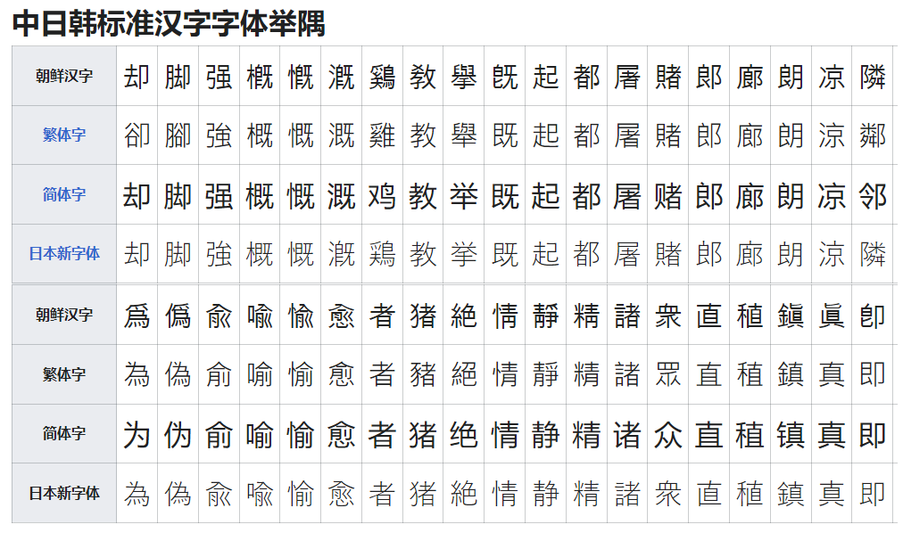
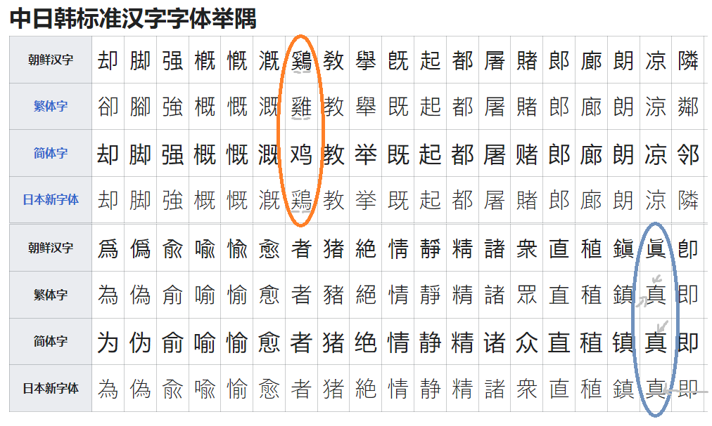
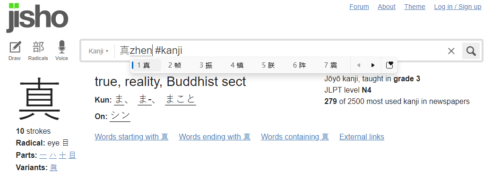
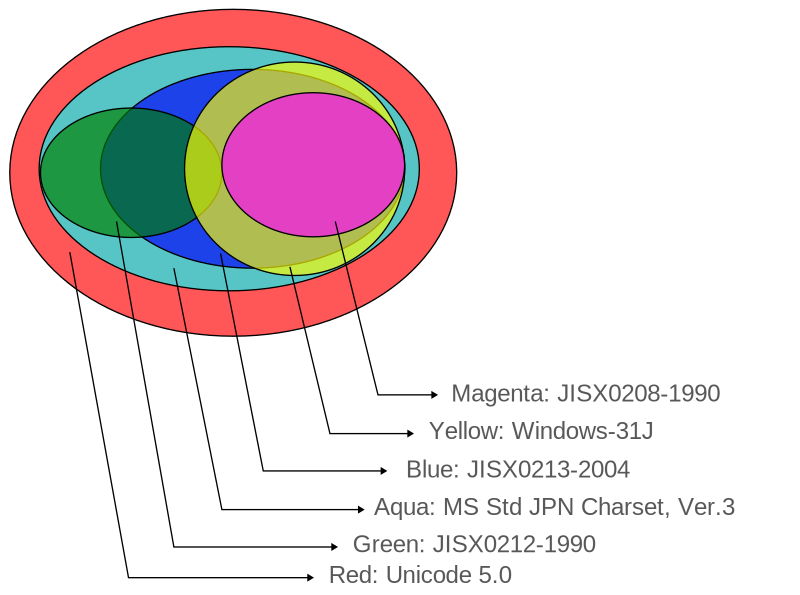

<!-- theme: gaia -->

# Text Processing III

---

### Looking back

Part I（Lecture 8-10）
* Agenda of Text Processing
* String Representations in C and C++
  * C styled string, `std::string`, `std::string_view`
* String Manipulation
  * Create/Contatenate/Join/Split/...
  * STL: `string`, `string_view` (14), `ranges` for `string`(20)
  * Libraries: *Boost*, *{fmt}*, (14) *Abseil*, (14) *range-v3*

---

### Looking back

Part II (Lecture 11)
* String examination
  * Getting string length in byte
  * *find*
    * `string`: `find / rfind / find_*_of`
    * `string`: `(23）contains / (20) starts_with  / (20) ends_with`
    * `<algorithm>/<ranges>`: `find / search / includes`
    * *Boost.StringAlgorithm*

---

### Discuss some topics other than C++ ...

---

### 字符串(string)、语言(language) 与 文字(writing system, or scripts)

字符串是 *字符*(*Character*) 的 “线性存储”（串）

主要设计来记录文字

但是不仅仅是文字

*字符* 是经过**编码**的 *信息单位*

---

### 语言(language) 和 文字(writing system)

关联但是并不完全一致的两个系统

存在没有文字的语言
* 手语系统
* 几乎所有的上古形制的语言都是先于文字出现的
* 为某种语言，人为发明文字，比如西夏文、伯格里苗文
* 大部分还在活跃中的语言都有对应的文字

但是没有语言基础的文字基本不存在

---

世界上大约有近7000种文字，包括

* 由历史传承、现在正在使用的（英语、汉语）；
* 历史上使用、但是现在已经不再使用的（甲骨文[标准化中]、圣书体[U+13000 + U+1342F]）；
* 从其他系统借来的符号（日语汉字、朝鲜语汉字）；
* 匹配已有语言系统所设计的书写系统（越南语、汉语拼音、西夏文）；
* 为口头语言设计的书写系统（注音苗文）；
* 助记系统（纳西语东巴文[U+1AAC0 - U+1AFFF]
  * 或许二维码也可以归属到助剂系统中

---

* 语素文字 - 汉字、圣书体、玛雅文、锲形文字
* 表音文字
  * 音节文字 - 日文假名、彝文（老头环曾在官方泄露资料中使用彝文作为注音）
  * 拼音文字
    * 全音素文字 - 拉丁、希腊、西里尔、韩文（谚文）
    * 元音附标文字 - 泰文、缅甸文、梵文
    * 辅音音素文字 - 阿拉伯、希伯来
    * 半音节文字 - 注音符号

---

### 五大字母系统

拉丁系文字 - Latin - Latīnum

阿拉伯系文字 - Arabric
أَبْجَدِيَّة عَرَبِيَّة

西里尔系文字 - Kirillica - Кири́ллица

梵文 - Sanskrit - संस्कृता वाक्

汉字 - Chinese Characters - 漢字

---

### 其它有重要影响力的文字系统

腓尼基语 - Phinican - 𐤃𐤁𐤓𐤉𐤌 𐤊𐤍𐤏𐤍𐤉𐤌 

婆罗米系（波密系）文字 - Brahmic scripts - 𑀩𑁆𑀭𑀸𑀳𑁆𑀫𑀻 𑀮𑀺𑀧𑀺 
* 是现代东南亚多种语言的父系语言，比如泰文。

---

### 需要编码的码位

* *字素*（*Grapheme*）及其 异写
  * 字素是最小可区分的书写单位
  * 字素的异写(upper/lower cases, variant chinese characters)
    * Upper/lower case
      * A / a
    * Variant Chinese Characters
      * 回[U+56DE]，囘[U+56D8], 囬[U+56DC]

---

### 需要编码的码位

* 不同语言相同（近）文字是否需要多个码位？
  * 不需要
    * 汉语拼音声调： a (英语) / ā（拉脱维亚语）/ à（拉丁语系，比如法语、意大利语、葡萄牙语）
  * [被统一](https://zh.m.wikipedia.org/zh-hans/%E4%B8%AD%E6%97%A5%E9%9F%93%E7%B5%B1%E4%B8%80%E8%A1%A8%E6%84%8F%E6%96%87%E5%AD%97)
    * 中日韩统一表意文字（CJK Unified Ideographs）
      * 把分别来自中文、日文、韩文、越南文、壮文、琉球文中，起源相同、本义相同、形状一样或稍异的表意文字，在ISO 10646及Unicode标准赋予相同编码
    * 表意文字认同原则、原字集分离原则、起源不同原则

---

### 需要编码的码位

CJK的优点和缺点

不需要仔细区别同一点位文字所属语言，利于搜索

同点位文字在不同语言间存在些许字体差异，混排时如果没有特殊的记号或者排版算法，差异难以保留。

---

---

---

---
### 需要编码的码位

* 隹
* 鵻 == (尔雅/释鸟)䳕鳩(foujiu) == 鳺(fu)鴀(fou) == 鵓鴣
* 上古读音：bu ku
* 布谷
* 杜鹃

---

### 需要编码的码位

* *音素* (*Symbol* in *Syllabus*, *phoneme*)
* *附加符号*（比如*音调*）
  * 热҈的҈字҈都҈出҈汗҈了҈
  * U+0488，西里尔文修饰符` ҈`
* *符号* (*Symbol*)
  * Emoji
    * 😂 [U+1F602]
  * 六十四卦
    * ䷰（U+4DF0，革）䷱（U+4FD1，鼎）
  * 制表符号
    * ├┴┬─┼

---
### 需要编码的码位

* *空白* (*Whitespace*) 或 *标点符号*(*Punctuation*)  
* *控制字符* (*Control characters*)
  * 例如：CR符 [U+000D]
* 其他
	* 会在讨论Unicode的编码平面中具体介绍
---

### 不需要编码的部分

* 字体/字形
  * 与异体字并非泾渭分明
    * 对于已经不再流通且难以溯源的古文字来说，字体和独立文字的区别相对难以区分，比如甲骨文
    * 隶体/楷体（异体字） -> 行书/草书（字体） -> 简化字（异体字）
* 排版/书写顺序
  * LTR
  * 竖向排版 - 汉语、日语
  * RTL(Right to Left) - 阿拉伯语

---

### 不需要编码的部分

* 特定的符号组合
  * 比如西里尔字母修饰、泰语修饰和基本字母间仅存在有限组合
  * Unicode并未一组合一码
    * 设计为正交编码系统，以节省码位
    * 复杂情况的字符排版由CTL（Complex Text Layout）决定
      * 天城文合字（Ligature）： द + ् + ध + ् + र + ् + य = द्ध्र्य 
      * 合字也可以由字体决定 - [Jetbrains Mono](https://www.jetbrains.com/lp/mono/)
* 会导致超出原应用范围的文字渲染出现，比如泰语修饰符的无限叠加
  * 例如：ส็็็็็็็็็็็็็็็็็็็็็็็็็็็็็็็็็็็็็็็็็
  * 但是实际上在语言中并不存在这个文字

---

### Quiz：全世界的“盲文”是否一样？

---

### 盲文

由法国人 Braille 发明的语言。
类比于 ASCII 的编码系统 —— 存储、解码均只有有限的分辨率。

对于Latin系文字，对应26个字母。各语言在其音符、联拼的变种。

对于汉语，是表音文字（类似拼音）；阿拉伯数字同英文盲文，选择了 Braille 式。

日本汉字盲文按照字根设计。

Unicode: +2800 to +28FF

---

### 从文字到渲染

文字系统
-> 字元 
-> 字符集（字元->顺序）
-> 编码方案/编码（整数->字节）
-> 字体查找 -> Fallback 
-> 字形查找 -> Fallback 
-> 字形渲染 (Glyph processing)

1 [Microsoft Typography documentation](https://learn.microsoft.com/en-us/typography/)
2 [IDWriteFontFallback::MapCharacters method (dwrite_2.h)](https://learn.microsoft.com/en-us/windows/win32/api/dwrite_2/nf-dwrite_2-idwritefontfallback-mapcharacters)

---

字符集

* 字符的合集，为每个字符提供唯一的表示（不一定是一个整数）
* JIS X 0208-1990中，“工”字位于25区09点

编码方案

* EUC-JP: 双字节编码 - `{区+160, 点+160}`
* Shift_JIS: 双字节编码 - `{...编码很复杂..., ...编码也很复杂...}`
  * 「区」が01～61の奇数の場合:「区」に257を加えて2で割った値を1バイト目とします。 「点」が01～63なら63を加えた値を、さもなくば64を加えた値を2バイト目とします。
  * 兼容 JIS X 0208-1990; 0208-1983; JIS C 6226-1978 字符集

---

### 前 Unicode

不同系统、不同语言、不同地区均可能有各自独立的编码标准

(US-)ASCII (American Standard Code for Information Interchange)
* Control code
	* `00`  NULL / `07` BELL
	* `09` HT/SK (Horizontal Tab) / `0B` VTAB (Vertical Tab)
	* `0A` LF (Line Feed) / `0D` CR (Carriage Return)
* Printable Characters
	* Letters, Digits, Prunctions, and other symbols

---
### 前 Unicode

ISCII (Indian -)

ArmSCII (Armenian -)

PASCII(Perso-Arbic -)

ATASCII (Atari), ...

---

### 前 Unicode
GB/T 2312-1980 (GB2312)  国标/推荐（非强制）
* Hanzi
* Non-Hanzi
  * Punctuation/Symbols,  List Markers, ISO 646-CN, Hiragana（平假）, Katakana（片假）, Greek and vertical, Cyrillic, zhuyin and non-ASCII pinyin, box drawing
* 扩展及实现
	* Encoding: EUC-CN, ISO-2022-CN, HZ
	* Succeed/Extension: GB/T 12345, GBK, GB18030

---

### 前 Unicode

GBK
* 扩展及实现
	* (Windows) CP936
		* GBK最广泛使用的编码方法
	* (IBM) CP1386/IBM-1386
		* IBM's CP936 is also a Simplified Chinese code page but unused

---

### 前Unicode

BIG5
* 大五码，港澳台使用的繁体字的编码标准
* 扩展及实现
	* (Windows) CP950

---

### 前 Unicode

Shift-JIS

---

### 前 Unicode

ISO/IEC-8859 西欧字符集
* 1: 29 Languages, includes English, Spanish, Italian, PorNorwegian, Irish, ...
* 15: Superset of 1, more languages/more rare characters supported, for e.g. Š in Finnish

Most Popular Implementation/Extension: Windows-1252 (CP1252) 

---

### 乱码

---

### 乱码

文字系统(writing system) -> 字元/符号(grapheme/symbol)

-> 编码字符集(character set)（字元->序列）

-> 编码方案/编码（序列->字节）

-> 字体查找 -> 字形查找 -> Fallback (e.g. IDWriteFontFallback)

-> 字形渲染 (Glyph processing)

---

字形渲染是个大话题：

需要处理 位置、尺寸、基线、肩高、上下标、对齐、微调、抗锯齿、连字(Ligature)、合字（部分支持） 等诸多特性。

---

### 乱码

1 应用程序与数据的编码格式/字符集不同

2 缺少字体文件

3 应用程序自身的错误

4 错误的将一般的二进制数据理解为文字

 

* **示例代码**

---

### 乱码的自动甄别工具如何识别乱码？

* 基于统计理论 —— 看起来像

* 适用于整段文字隶属同一字符集

---

### Unicode

解决混排文字无法 Trivial 表达的问题
* 比如一个数组中同时存有汉语、韩语、越南文字，要如何表达？
  * Unicode之前并不存在这样的单一代码页。

CJK文字的跨语言搜索

解决罕用字符的表达点位
* 否则需要开个谁都不会去支持的代码页
* 甚至连跨系统的Emoji都不会有

灵活且标准的编码形式 —— 可变单字节，可变双字节，定长四字符，应有尽有

---

### Unicode 码位概览

UCS-2/4

<iframe src="https://zh.m.wikipedia.org/wiki/Unicode%E5%AD%97%E7%AC%A6%E5%B9%B3%E9%9D%A2%E6%98%A0%E5%B0%84"></iframe>

---

### UTF-16

在BMP上，等价于UCS-2。或者说 —— UCS-2 就是不支持 Surrogate Pair 的 UTF-16

---

### 下期预告

UTF: Unicode码位的编码
* UTF-8/16/32

C++ 中的字符表达
* `char`; `wchar_t`;
* `char8_t`; `char16_t`; `char32_t`;
* `u8"测试"`, `u"测试"`, `U"测试"`, `L"测试"`, `_T("测试")`

编码字符集转换

多字节字符的处理